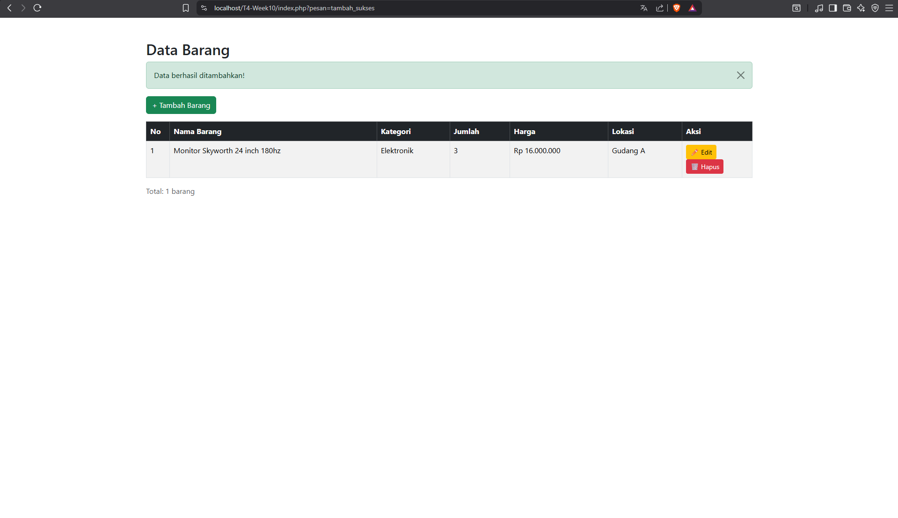
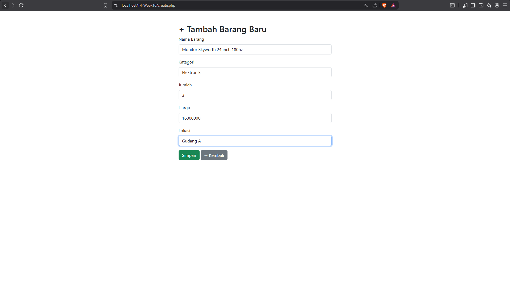
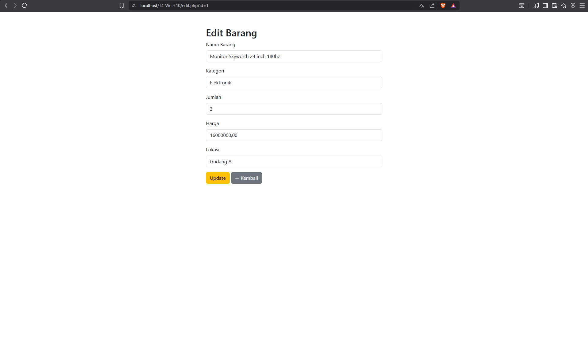
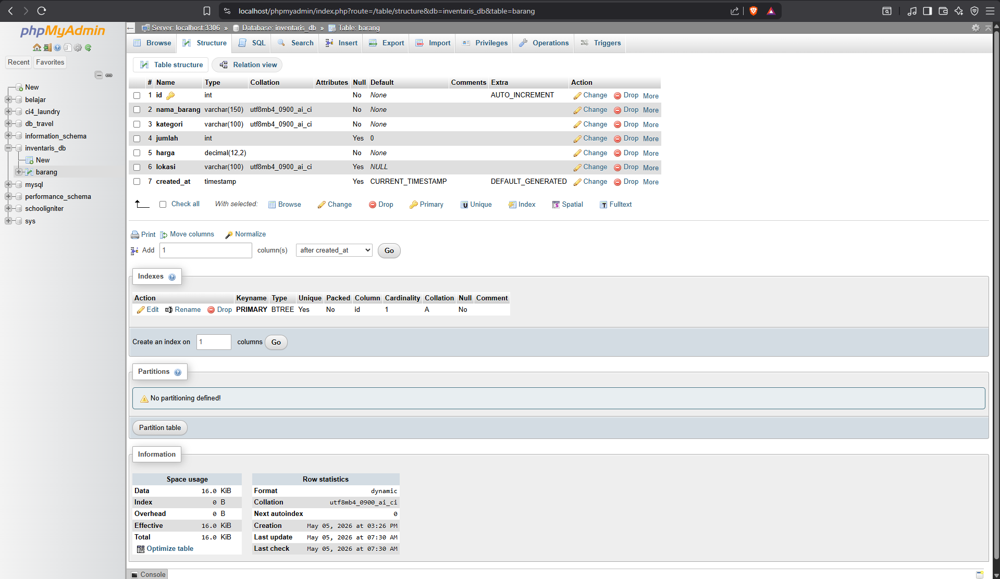

# T4-week10 - Aplikasi CRUD PHP MySQL

Nama  : Lalu Galang Abdullah
NIM   : F1D02410064
Kelas : Pemrograman Web

## Deskripsi
Aplikasi CRUD (Create, Read, Update, Delete) menggunakan PHP, MySQL, dan Bootstrap.

- Database : inventaris_db
- Tabel : barang

## Screenshot

### Daftar Data

### Tambah Data

### Edit Data

### Struktur Database (phpMyAdmin)

